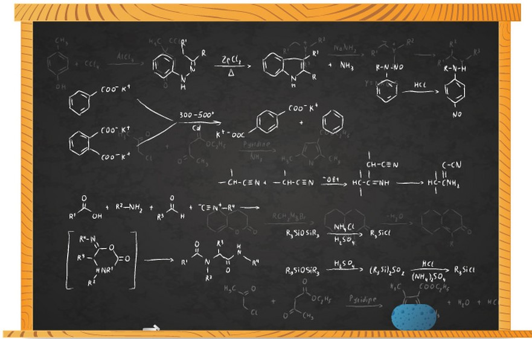
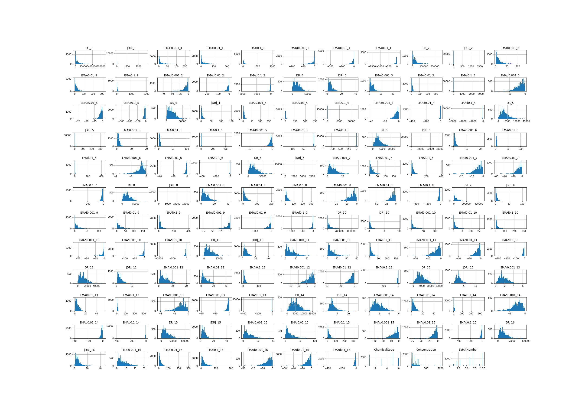
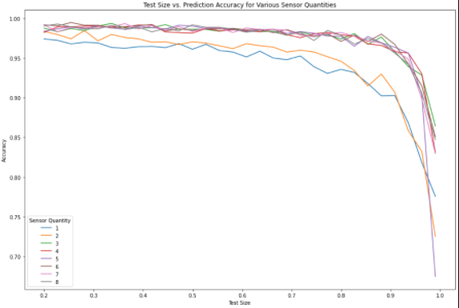

# Classification of Chemical Species

Industries such as Semiconductor, Pharmaceuticals, and Oil depend on precise chemical reactions in the manufacturing of their products. In order to acheive this precision the chemical species, concentration and temperature must be tightly controlled. If the wrong reactants species or concentration is used the chemical balance can result in undesired or incomplete chemical products.

However, the current state for controlling many of the manufacturing processes requires human intervention, which is prone to error. It is the goal of this project to determine if it is possible to automatically classify chemical species using a sensor array as a means of managing the risk to product quality from human error.

## Data Source

The BioCircuits Institute at the University of California - San Diego has graciously provided this data

The data provided contains 13,910 measurements that were taken from 16 chemical sensors that were exposed to 6 different gases (Ammonia, Acetaldehyde, Acetone, Ethylene, Ethanol, Toluene) of varying concentration levels. The measurement data was meticulously gathered over 36 months in a gas delivery platform facility at the ChemoSignal Laboratory in the BioCircuits Institute.

Additioanl information can be found here: 
[UCI Sensor Array Dataset](http://archive.ics.uci.edu/ml/datasets/Gas+Sensor+Array+Drift+Dataset+at+Different+Concentrations)

## Data Exploration

[Data Exploration Report](https://github.com/scosam/ChemicalPredictions/blob/master/notebooks/Capstone2EDA.ipynb)

Luckily there were no missing values or duplicate rows from the dataset, but there was a significant amount of experimental runs with outlying values and the data has a lot dimensions that are highly correlated

**Problem 1:** 35.3% of the experimental runs had at least one sensor feature that was an outlier using the standard definition of *values more than 1.5 times the IQR outside of the IQR (25th percentile to 75th percentile range).* This is accentuated by the large amount of white space in the histograms of the features that is numerically representented with large kurtosis values (>1000).

**Solution:** Performed bootstrap null hypothesis testing to determine if the outlier values may be caused by a specific chemical species, chemical concentration, and experimental batch or if the values might be erroneous. The significance value was based on standard value of 0.05 divded by the number of tests (i.e. There are 6 chemicals tested for significance, so p-value must be less than 0.05/6). It was found that outlier values were associated with high concentrations (>350 ppm), chemical 5, and certain batches. Although the significance of these individual tests could be confounded with eachother, it is likely that the outlying data is not erroneous and we can keep it.

**Problem 2:** Many of the predictor features are highly correlated, either positively or negatively, to each other, which can lead to high variance in the model weights.

**Solution:** Reduce the dimensionality using PCA, or a similar method.

## Modeling Setup & Results
**Baseline Model**
To establish a baseline to compare against the more complex models that will be created, the accuracy of two simple rules was calculated. If the predicted class is selected at random, the theoretical model accuracy is 16.7%. If the predicted class is always the chemical species used in the most experiments, then the model accuracy is 28%.

**Model Selection**
Five model algorithms were evaluated for score time and accuracy: Linear SVC, k Nearest Neighbors, Random Forest, Gaussian Naive Bayes, Decision Tree. The average values of 3 fold cross validation on 3 datasets of varying training size were used to determine which model could perform well with a smaller amount of training data.

**Result**
The random forest model performed the best so a random forest model was fit using every combination of test size, between 0.2 and 0.99, and number of sensors used resulting in 160 models being created. The conclusions we can make is that at least 3 sensors need to be used in 800 experimental runs to achieve an accuracy of 0.99.

## Citations

A Vergara, S Vembu, T Ayhan, M Ryan, M Homer, R Huerta. "Chemical gas sensor drift compensation using classifier ensembles." Sensors and Actuators B: Chemical 166 (2012): 320-329.

I Rodriguez-Lujan, J Fonollosa, A Vergara, M Homer, R Huerta. "On the calibration of sensor arrays for pattern recognition using the minimal number of experiments." Chemometrics and Intelligent Laboratory Systems 130 (2014): 123-134.